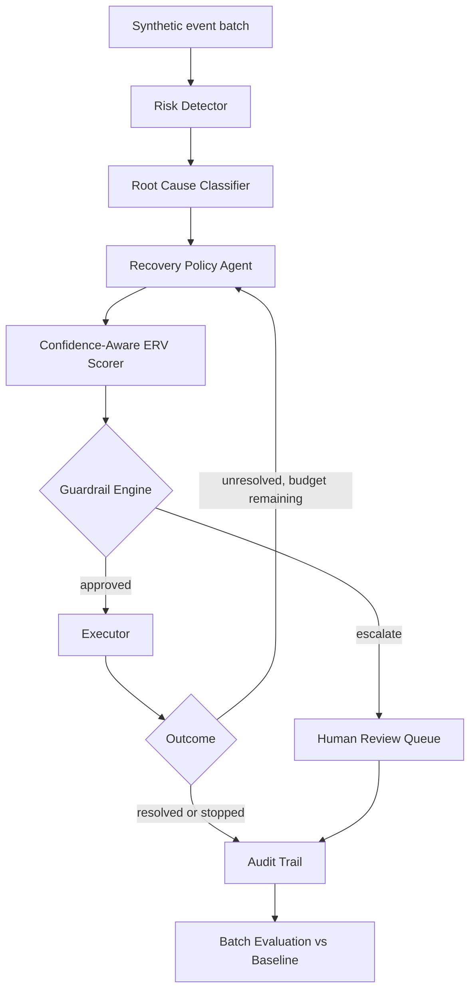
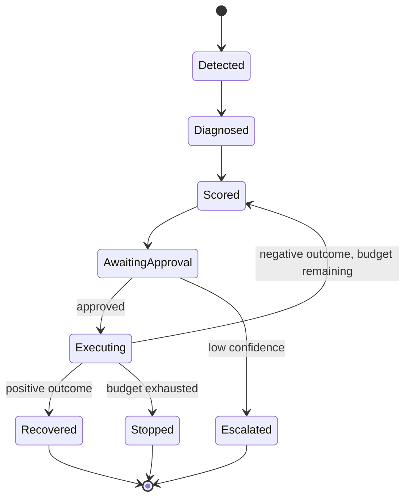
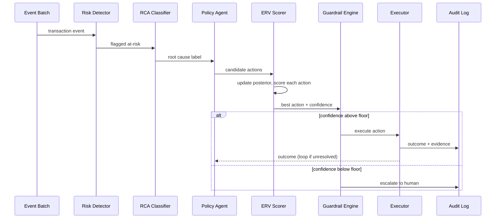

# RECLAIM — Architecture & Technical Design
**AI Revenue Recovery Agent · Track 03, Razorpay AI Buildathon**

---

## 1. Problem

Revenue leaks out of a merchant's business in three quiet ways: a payment fails and nobody follows up in time, a checkout is abandoned mid-flow, or an invoice goes overdue and sits untouched. Today, where it's handled at all, it's handled with blunt, fixed-schedule reminders — no sense of which case is worth chasing, how hard to chase it, or when to stop. RECLAIM is a closed-loop agent instead of a reminder script: detect the at-risk event, diagnose why it happened, choose the highest-expected-value response, act inside hard guardrails, and prove the result against a baseline on a real batch.

**The one technical bet this design makes:** instead of a fixed probability model for "will this action recover this case," RECLAIM maintains a Bayesian confidence estimate per failure-type/action pair that sharpens as the batch runs. That single mechanism is what turns the escalation guardrail into a real threshold instead of an arbitrary rule, and what makes "the system learns across the batch" a true claim instead of a demo line. Section 5.4 covers it in full.

## 2. Architecture



Every box is one module in the codebase; every arrow is a function call or a state transition, not an aspiration. Nothing here requires a service that isn't a plain Python process talking to a SQLite file.

## 3. Case lifecycle

The diagram above shows the system. This one shows what happens to a single case over time.



The `Executing → Scored` edge is the re-evaluation loop: an unresolved case goes back through scoring with updated context — one more failed attempt, less budget left — rather than blindly repeating the same action.

## 4. One case, end to end



## 5. Components

### 5.1 Risk Detector
Rule-based thresholds first — failed-payment count, checkout drop-off point, days-overdue bucket — plus one lightweight classifier (LightGBM) layered on top if the synthetic data has enough signal to support it. Output: an at-risk flag and a raw risk score, nothing more.

### 5.2 Root Cause Classifier
A lookup table from structured event codes (issuer decline reason, gateway timeout, abandonment step, overdue bucket) to a small set of root-cause categories. Deterministic on purpose: the synthetic generator controls these codes, so a learned classifier would be solving a problem that doesn't exist yet, at the cost of being one more thing that can misfire in the critical path.

### 5.3 Recovery Policy Agent
Given a diagnosed case, proposes 2–4 candidate actions suited to its root cause and channel — retry with backoff, alternate payment method, a short-link reminder, manual escalation. This step generates options; it doesn't decide between them.

### 5.4 Confidence-Aware ERV Scorer — the differentiator

For each candidate action *a*:

```
ERV(a) = P(recovery | context, a) × recoverable_amount
         − intervention_cost(a) − friction_penalty(a) − risk_penalty(a)
```

`P(recovery | context, a)` is not a fixed number pulled from a single model. It's the mean of a `Beta(α, β)` posterior kept per (root-cause category, action) pair, starting from a weak, uninformative prior and updated with every outcome observed as the batch runs:

```python
# on observing the outcome of (root_cause, action)
if recovered:
    alpha[root_cause, action] += 1
else:
    beta[root_cause, action] += 1

p_recovery = alpha / (alpha + beta)
confidence = alpha + beta   # or the Beta distribution's variance, for a sharper signal
```

Two things follow from this one mechanism:

- **The escalation guardrail becomes real.** "Low-confidence decisions require review" is backed by an actual number — a wide posterior, few observations — instead of being an arbitrary threshold with nothing behind it.
- **The system learns across the batch, not just within one case.** Case #200 is scored using everything observed in cases #1–199. A model trained once up front and then frozen wouldn't show this, and it's a materially different — and more defensible — claim than "the agent adapts."

This is the same belief-under-uncertainty approach used for regime confidence in RACER, a regime-adaptive ensemble router built for algorithmic trading — applied here to recovery decisions instead of market signals.

### 5.5 Guardrail Engine
Evaluated before any action executes, never after:
- Posterior confidence below a set floor → escalate, don't auto-execute.
- Contact attempts per case capped (recovery budget) → stop rather than retry indefinitely.
- Action must be in a pre-approved, defense-only action set → anything outside it is rejected outright, not attempted and logged as a mistake.

### 5.6 Executor
A deterministic simulator by default: draws an outcome (recovered, not recovered, channel failure) from configurable probabilities per action and root cause, with deliberate failure injection available for the demo. Razorpay test-mode APIs can replace the simulator for the payment-link-creation action specifically, once credentials are available — a swap that touches nothing upstream.

### 5.7 Audit Trail
One append-only record per case: evidence considered, root cause, action taken, confidence at decision time, outcome, and — for stopped or escalated cases — the specific reason. This is what "compliant escalation, stopping rules, and an audit trail" means in code, not on a slide.

## 6. Data & evaluation

- Roughly 250 synthetic cases across the two scenarios this build covers: payment failures and checkout abandonment.
- A fixed baseline strategy runs on the identical batch for comparison: one retry, then one reminder, then stop — no diagnosis, no scoring.
- Reported per batch: recovery rate and ₹ recovered for RECLAIM vs. baseline, false-escalation rate, and guardrail/stop trigger counts.
- The baseline is what makes the ₹ figure mean something. A recovered-amount number with nothing to compare it to is a demo trick, not evidence.

## 7. Track 03 bar → where it's satisfied

| Requirement | Satisfied by |
|---|---|
| Detects revenue at risk | Risk Detector (5.1) |
| Determines the right intervention | Policy Agent + ERV Scorer (5.3, 5.4) |
| Executes a bounded recovery workflow | Guardrail Engine + Executor (5.5, 5.6); lifecycle in §3 |
| Measured money recovered across a batch | §6, evaluated against the baseline |
| Compliant escalation | Confidence floor, Guardrail Engine (5.4, 5.5) |
| Stopping rules | Recovery budget cap (5.5) |
| Audit trail | 5.7 |

## 8. Explicitly out of scope

Subscription and receivables adapters, merchant-policy persistence beyond the in-run posteriors, multilingual or voice channels, a production frontend, live (non-test-mode) payments. None of these are cut for lack of ideas — a working, well-evidenced core loop beats a wider system that's half-finished at the deadline.

## 9. Stack

Python · SQLite · a hand-written state machine (no orchestration framework) · deterministic simulator, with the Razorpay test-mode API for payment-link creation where credentials allow · pandas/matplotlib for the evaluation output · Streamlit only if time remains after the core loop and batch evaluation are solid.

## 10. Build plan

| Day | Focus |
|---|---|
| 1 | Synthetic event generator (~250 cases), baseline strategy, SQLite schema, Risk Detector |
| 2 | RCA lookup table, candidate action generator, the Bayesian ERV Scorer |
| 3 | State machine, simulator, Guardrail Engine, audit logging; swap in real payment-link API if ready |
| 4 | Batch evaluation script, baseline comparison, metrics |
| 5 (morning) | README, this document finalized, demo video, one forced failure case on camera |
