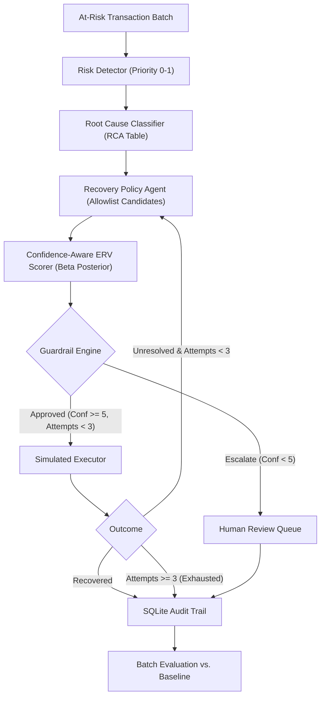

# RECLAIM — AI Revenue Recovery Agent
> **Razorpay AI Buildathon — Track 03: AI Revenue Recovery**

RECLAIM is an autonomous, defense-only AI agent that recovers lost revenue from payment failures and checkout abandonments. Instead of spamming customers with blunt, static reminder schedules, RECLAIM diagnoses failure root causes, scores candidate interventions via a **Bayesian Beta(α, β) Expected Recovery Value (ERV) Scorer** that sharpens its beliefs across the batch, and acts inside strict, verifiable guardrails with append-only SQLite audit trails.

---

## 1. Key Results vs. Static Baseline

Evaluated across **280 synthetic events** (140 payment failures + 140 checkout abandonments) with seeded reproducibility:

| Metric | Baseline (Static 1-Shot) | RECLAIM (AI Agent) | **Incremental Uplift** |
| :--- | :---: | :---: | :---: |
| **Total Revenue Recovered** | **₹788,378.27** | **₹1,644,192.95** | **+₹855,814.68 (+108.6%)** |
| **Overall Recovery Rate** | **31.8%** (89/280) | **62.1%** (174/280) | **+30.4% points** |
| **Escalation Rate (Human Review)** | 0.0% | **17.5%** (49/280) | *Compliant confidence gating* |
| **Stopping Rate (Attempts Exhausted)**| 68.2% | **20.4%** (57/280) | *Enforced at $\le 3$ contact attempts* |
| **Audit Compliance** | None | **100%** | *Mandatory `stop_reason` on all stops* |

### Root Cause Recovery Breakdown

```
Root Cause                 | Cases | Baseline Rate (₹) | RECLAIM Rate (₹)  | Incremental Delta
---------------------------+-------+-------------------+-------------------+------------------
otp_friction               | 33    | 21.2% (₹84k)      | 78.8% (₹294k)     | +₹210,000 (+57.6% pts)
payment_friction           | 40    | 40.0% (₹184k)     | 85.0% (₹403k)     | +₹219,000 (+45.0% pts)
low_intent_drop_off        | 67    | 25.4% (₹159k)     | 46.3% (₹327k)     | +₹168,000 (+20.9% pts)
customer_action_needed     | 64    | 15.6% (₹69k)      | 46.9% (₹204k)     | +₹135,000 (+31.3% pts)
retry_likely_to_succeed    | 52    | 73.1% (₹285k)     | 90.4% (₹364k)     | +₹78,000  (+17.3% pts)
requires_verification      | 24    | 4.2%  (₹7k)       | 25.0% (₹53k)      | +₹45,000  (+20.8% pts)
```

---

## 2. Architecture & The One Technical Bet



### The Bayesian ERV Scorer
$$\text{ERV}(a) = P(\text{recovery} \mid \text{rootCause}, a) \times \text{amount} - \text{cost}(a) - \text{friction}(a) - \text{risk}(a)$$

- Instead of a static or blackbox ML classifier, RECLAIM maintains a **$\text{Beta}(\alpha, \beta)$ posterior** for each `(root_cause, action)` pair.
- The prior is weak uniform ($\alpha_0=1, \beta_0=1$).
- **The system learns across the batch:** Case #200 is scored using empirical recovery data from cases #1–199.
- **Confidence is explicit:** $\text{Confidence} = \alpha + \beta - 2$ (number of real observations). If $\text{confidence} < 5$, the agent escalates to human review rather than guessing.

### LLM Narration Layer
An LLM narration layer (Groq / Llama 3) drafts customer-facing messages and human-review escalation briefings **after** each decision is finalized — additive only, with a hardcoded template fallback if the API is unavailable. All five decision components upstream (risk scoring, RCA, policy generation, ERV scoring, guardrails) remain rule-based or Bayesian-statistical by design.

> **Note on escalation accounting:** When a case is escalated, the agent still executes the action once (to collect a real observation for the Bayesian posterior), but the outcome is always logged and counted as `"escalated"` — even if that execution would have succeeded. Escalated cases' ₹ recovery does not count toward the autonomous recovery headline.

---

## 3. Defense-Only Action Allowlist

RECLAIM operates within a frozen action allowlist. Proposing or executing any action outside this list raises an immediate structural assertion error:

1. `retry_payment` (₹0 cost, ₹0 friction)
2. `alternate_payment_method` (₹0 cost, ₹5 friction)
3. `reminder_message` (₹2 cost, ₹3 friction)
4. `otp_assist_link` (₹2 cost, ₹3 friction)
5. `manual_escalation` (₹50 cost, ₹10 friction, ₹5 risk penalty)

---

## 4. Quick Start & Setup

### Prerequisites
- Python 3.10+
- SQLite3 (included in standard library)

```bash
pip install -r requirements.txt
```

**Optional dependencies** (not required for the core pipeline):
- `razorpay` — enables live test-mode payment link generation
- `groq` — enables LLM-drafted customer messages (template fallback used if absent)

---

## 5. Running the System

### 5.1 Batch Evaluation (RECLAIM vs. Baseline)
Executes the full evaluation comparison across all 280 cases, prints terminal metrics, saves `evaluation_results.txt`, and generates comparison PNG charts:

```bash
python -m reclaim.evaluation.run_evaluation
```
*Generated Charts:*
- `recovered_amount_by_strategy.png` (Headline ₹ comparison)
- `recovery_rate_by_root_cause.png` (Performance breakdown per failure cause)

### 5.2 Single-Case Demo Walkthrough (For Presentations & Video)
Walks through all stages of an individual case (signal ➔ risk ➔ RCA ➔ ERV ranking ➔ guardrail ➔ execution ➔ audit):

```bash
# Standard successful recovery walkthrough
python -m reclaim.evaluation.demo_scenario

# Failure injection mode (demonstrates retries, posterior updates, and stopping rules)
python -m reclaim.evaluation.demo_scenario --force-failure
```

### 5.3 LLM Narrative Generation (Post-Evaluation)
Generates LLM-drafted customer messages and escalation briefings from the completed audit trail:

```bash
python -m reclaim.evaluation.generate_narratives
```

### 5.4 Automated Test Suite
Runs all 18 unit tests validating guardrails, state machine lifecycles, Bayesian learning, and Razorpay adapter degradation:

```bash
python -m pytest reclaim/tests/ -v
```

---

## 6. Repository Layout

```
reclaim/
├── ARCHITECTURE.md                  # System architecture & technical design
├── AGENT.md                         # Full agent context & system specification
├── AGENTS.md                        # Quick pointer & agent workflow guidelines
├── evaluation_results.txt           # Latest batch evaluation metrics output
├── recovered_amount_by_strategy.png # Evaluation chart: Recovered ₹ comparison
├── recovery_rate_by_root_cause.png  # Evaluation chart: Recovery rate by RCA
├── requirements.txt                 # Core + optional dependencies
├── reclaim/
│   ├── data/
│   │   ├── schema.sql               # SQLite cases & audit_trail tables
│   │   └── generator.py             # 280 synthetic cases with hidden true probabilities
│   ├── agents/
│   │   ├── risk_detector.py         # Rule-based 0-1 risk score (amount & urgency)
│   │   ├── rca.py                   # Fixed lookup table classifier (6 root causes)
│   │   ├── policy_agent.py          # Proposes 2-4 candidates strictly from allowlist
│   │   ├── erv_scorer.py            # Beta(α,β) Bayesian ERV Scorer
│   │   ├── guardrails.py            # Confidence floor (<5) & attempt cap (3) checks
│   │   └── narrator.py              # LLM narration layer (Groq/Llama 3 + template fallback)
│   ├── core/
│   │   ├── state_machine.py         # Closed-loop case lifecycle state machine
│   │   ├── executor.py              # Deterministic seeded simulator (+ failure injection)
│   │   ├── razorpay_adapter.py      # Razorpay test-mode payment link API adapter
│   │   └── audit.py                 # SQLite append-only audit trail logger
│   ├── evaluation/
│   │   ├── baseline.py              # Naive 1-shot baseline comparison
│   │   ├── run_evaluation.py        # Batch evaluation, reporting, and chart generator
│   │   ├── demo_scenario.py         # Step-by-step single-case walkthrough script
│   │   └── generate_narratives.py   # Post-evaluation LLM narrative batch generator
│   └── tests/
│       ├── test_guardrails.py       # Guardrail unit tests
│       ├── test_state_machine.py    # State machine transition unit tests
│       ├── test_erv_scorer.py       # Bayesian posterior convergence & ERV tests
│       └── test_razorpay.py         # Razorpay adapter & graceful degradation tests
```

---

## 7. Deliverables & Acceptance Verification Checklist

- [x] `evaluation/run_evaluation.py` runs end to end on fresh clone and prints RECLAIM vs. Baseline comparison
- [x] `evaluation/demo_scenario.py` walks one case through every stage with printed output and supports `--force-failure`
- [x] All 18 unit tests in `tests/` pass with zero failures
- [x] Every `Stopped` / `Escalated` case has a corresponding audit row with mandatory `stop_reason`
- [x] Nothing outside the section 4.3 action allowlist is ever executed (assertion-enforced)
- [x] All randomness seeded with deterministic hashes for 100% reproducible execution
- [x] Incremental commits tracked throughout build in Git repository
